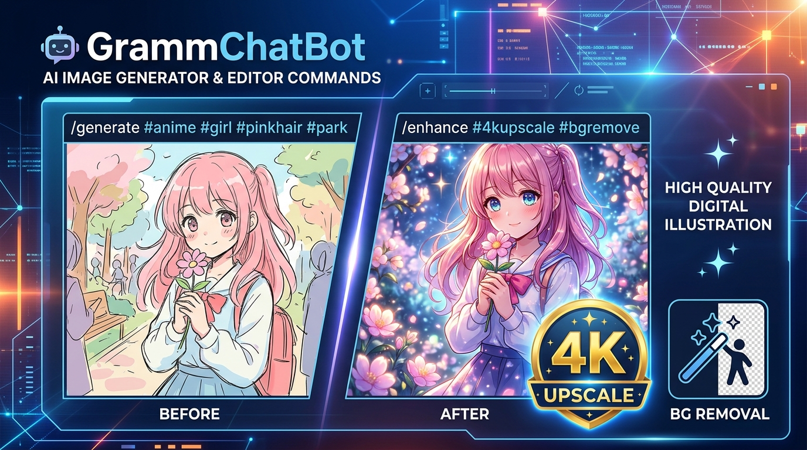

<div align="center">


# ⚡ GrammChatBot - FCA to TCA Framework Port (GoatBot V2)

```
   ██████╗ ██████╗  █████╗ ███╗   ███╗███╗   ███╗██████╗██╗██╗  ██╗██████╗  ██████╗ ████████╗
  ██╔════╝ ██╔══██╗██╔══██╗████╗ ████║████╗ ████║██╔════╝██║██║  ██║██╔══██╗██╔═══██╗╚══██╔══╝
  ██║  ███╗██████╔╝███████║██╔████╔██║██╔████╔██║██║     ██║███████║██████╔╝██║   ██║   ██║   
  ██║   ██║██╔══██╗██╔══██║██║╚██╔╝██║██║╚██╔╝██║██║     ██║██╔══██║██╔══██╗██║   ██║   ██║   
  ╚██████╔╝██║  ██║██║  ██║██║ ╚═╝ ██║██║ ╚═╝ ██║╚██████╗██║██║  ██║██████╔╝╚██████╔╝    ██║   
   ╚═════╝ ╚═╝  ╚═╝╚═╝  ╚═╝╚═╝     ╚═╝╚═╝     ╚═╝ ╚═════╝╚═╝╚═╝  ╚═╝╚═════╝  ╚═════╝    ╚═╝   
```

[](https://opensource.org/licenses/MIT)
[](https://core.telegram.org/bots/api)
[](https://nodejs.org/)
[](./test/testAll.js)

**GrammChatBot** is an elite Node.js bot framework that provides a **1-to-1 API Adapter Port** of [Goatbot-V2](https://github.com/lazyneoaz/Goatbot-V2.git) from Facebook Messenger (FCA) to Telegram (TCA).

By utilizing the built-in **FCA to TCA Adapter Layer** ([`system/api-adapter.js`](./system/api-adapter.js)), existing Goatbot V2 Facebook commands using `api.sendMessage()`, `event.threadID`, and `event.senderID` run natively on Telegram **without rewriting command logic**!

</div>

---

## 🎨 AI Image Tools Showcase

<div align="center">



</div>

GrammChatBot features built-in modular AI Image Commands designed for memory-efficient streaming:

- **`/image <prompt>` (`/dalle`)**: Generates high-definition AI digital art directly from text prompts.
- **`/edit <style>` (`/filter`)**: Applies AI transformations and stylistic filters to replied photos.
- **`/upscale` (`/4k`, `/hd`)**: Enhances image quality to 4K resolution.
- **`/removebg` (`/nobg`)**: Removes backgrounds and exports transparent PNGs.
- **⚡ Stream Optimization**: Media is streamed directly to Telegram using `ctx.replyWithPhoto({ source: response.data })`, eliminating large RAM buffers or disk overhead.

---

## 📊 Express Web Analytics Dashboard

<div align="center">


</div>

The integrated Express web server serves a live management dashboard on `process.env.PORT` (`http://localhost:5000`):

- **Real-Time Monitoring**: Displays polling status, active token index, total tokens, uptime, and memory usage.
- **Uptime Keep-Alive**: Includes `GET /` and `GET /health` 200 OK endpoints for UptimeRobot monitoring.
- **Auto-Cleanup Engine**: Runs a 30-minute cron job clearing `/cache` directories and triggering Node garbage collection (`--expose-gc --max-old-space-size=400`).

---

## 🔥 Key Features

- **FCA to TCA Adapter Layer**: Intercepts Telegram updates and maps them to standard Facebook Chat API (`api`) and event (`event`) objects.
- **Multi-Token Failover**: Array of Telegram Bot tokens in `config.json`. Automatically switches tokens on `429 Too Many Requests` or blocks, and alerts the Developer ID.
- **5-Level Role Permission Matrix**:
  - **Level 0 (User)**: Basic commands.
  - **Level 1 (Premium User)**: Premium commands & higher limits (`/admin premium add`).
  - **Level 2 (Group Admin)**: Group management (`ctx.getChatMember`).
  - **Level 3 (Bot Admin)**: Bot management (`adminBot` in `config.json`).
  - **Level 4 (Developer)**: Master access (`devUsers`). Required for `/shell` and `/eval`.
- **Developer Command Suite**:
  - `/eval`: Evaluates raw JavaScript directly in runtime (Level 4 Developer Only).
  - `/shell`: Executes host terminal commands (Level 4 Developer Only).
- **Smart Typo Suggestions**: Uses Levenshtein distance algorithm to find closest loaded commands (e.g. `/imgge` -> *"Command not found. Did you mean /image?"*).

---

## 📂 Project Structure

```
GrammChatBot/
├── images/
│   ├── banner.jpg              # Cute Anime Girl Mascot Header
│   ├── ai_demo.jpg             # AI Image Tools Showcase Banner
│   └── dashboard_preview.jpg   # Express Web Analytics Dashboard Mockup
├── index.js                    # Main process entry launcher
├── Goat.js                     # Core bot framework orchestrator
├── bot.js                      # Telegram event listener & router
├── config.json                 # Bot tokens, developer ID & permission lists
├── package.json                # Project dependencies (grammy, express, etc.)
├── system/
│   └── api-adapter.js          # Core FCA-to-TCA API Wrapper Adapter
├── includes/
│   ├── handleReply.js          # System listener for onReply
│   ├── handleReaction.js       # System listener for onReaction
│   └── handleEvent.js          # System listener for onEvent
├── bot/
│   ├── telegram/
│   │   ├── tokenManager.js     # Multi-token manager & rate-limit failover
│   │   └── handlerTelegram.js  # grammY update interceptor & role matrix
│   └── cron/
│       └── autoCleanup.js      # 30-minute cache & memory cleanup cron job
├── dashboard/                  # Express.js Web Dashboard
│   ├── app.js                  # Express web server & statistics routes
│   └── views/
│       └── stats.eta           # Real-time HTML stats dashboard template
├── utils/
│   └── levenshtein.js          # Levenshtein distance typo suggestion engine
├── test/
│   └── testAll.js              # Comprehensive automated test suite (100% Pass)
└── scripts/
    └── cmds/                   # Modular commands folder
        ├── example.js          # FCA-syntax command test (/examplecmd)
        ├── newcommand.eg.js    # Template command file
        ├── eval.js             # Level 4 Developer JS evaluator
        ├── shell.js            # Level 4 Developer shell executor
        ├── admin.js            # Level 3/4 Admin control panel
        ├── image.js            # AI image generator (Stream)
        ├── edit.js             # AI image editor (Stream)
        ├── upscale.js          # AI 4K image upscaler (Stream)
        ├── removebg.js         # AI background remover (Stream)
        ├── help.js             # Dynamic command menu
        ├── stats.js            # Bot memory & status
        └── ping.js             # Latency check
```

---

## ⚙ Configuration (`config.json`)

Configure your Telegram Bot Tokens, Developer ID, Admin IDs, and Premium IDs in `config.json`:

```json
{
  "telegramTokens": [
    "7123456789:AAEF... (Primary Bot Token from @BotFather)",
    "7987654321:AABX... (Backup Bot Token 1)",
    "7555555555:AACC... (Backup Bot Token 2)"
  ],
  "tokenRotation": {
    "autoRotateOnRateLimit": true,
    "retryAttempts": 3,
    "cooldownMs": 60000
  },
  "prefix": "/",
  "noPrefix": true,
  "adminBot": [
    "123456789"
  ],
  "premiumUsers": [
    "123456789"
  ],
  "devUsers": [
    "YOUR_TELEGRAM_USER_ID"
  ],
  "dashBoard": {
    "enable": true,
    "port": 5000
  }
}
```

---

## 💻 Developer Guide: Writing Commands in Native FCA Syntax

Thanks to [`system/api-adapter.js`](./system/api-adapter.js), you can write commands using the exact original Goatbot-V2 Facebook syntax:

```javascript
module.exports = {
  config: {
    name: "hello",
    aliases: ["hi"],
    version: "2.0",
    author: "frnAlt & Gtajisan",
    countDown: 2,
    role: 0,
    description: { en: "Say hello using classic Goatbot FCA syntax" },
    category: "utility"
  },

  // Classic Goatbot V2 signature
  onStart: async function ({ api, event, args, message, getLang }) {
    // api.sendMessage maps internally to Telegram's sendMessage!
    api.sendMessage(
      `Hello! Your Telegram ID is ${event.senderID} and Chat ID is ${event.threadID}.`,
      event.threadID,
      (err, info) => {
        // api.setMessageReaction maps to Telegram message reactions!
        api.setMessageReaction("👋", event.messageID, event.threadID);
      },
      event.messageID
    );
  }
};
```

---

## 🧪 Testing & Verification

Run the comprehensive automated test suite:
```bash
node test/testAll.js
```
Expected Output:
```
==================================================
📊 TEST RESULTS: 14 Passed, 0 Failed
==================================================
```

---

## 🚀 Installation & Deployment Guide

### 1. Local Setup
```bash
git clone https://github.com/frnAlt/GrammChatBot.git
cd GrammChatBot
npm install
# Edit config.json with your Telegram tokens and user ID
npm start
```

### 2. Render (Free Tier 512MB RAM)
1. Create a **Web Service** on [Render](https://render.com).
2. Connect your GitHub repository.
3. Build Command: `npm install`
4. Start Command: `npm start`
5. Set Environment Variable: `PORT=5000`

### 3. Railway
1. Deploy project from GitHub on [Railway](https://railway.app).
2. Add `PORT=5000` environment variable.
3. Railway automatically detects `npm start`.

### 4. VPS Deployment (PM2)
```bash
npm install -g pm2
pm2 start index.js --name "grammchatbot" --node-args="--expose-gc --max-old-space-size=400"
pm2 save
pm2 startup
```

---

## 📜 License & Credits

- **Original Architecture**: [Goat-Bot-V2](https://github.com/ntkhang03/Goat-Bot-V2) by NTKhang & Modded by frnAlt & Gtajisan.
- **Telegram Adapter Port**: GrammChatBot by frnAlt & Gtajisan.
- **License**: MIT
