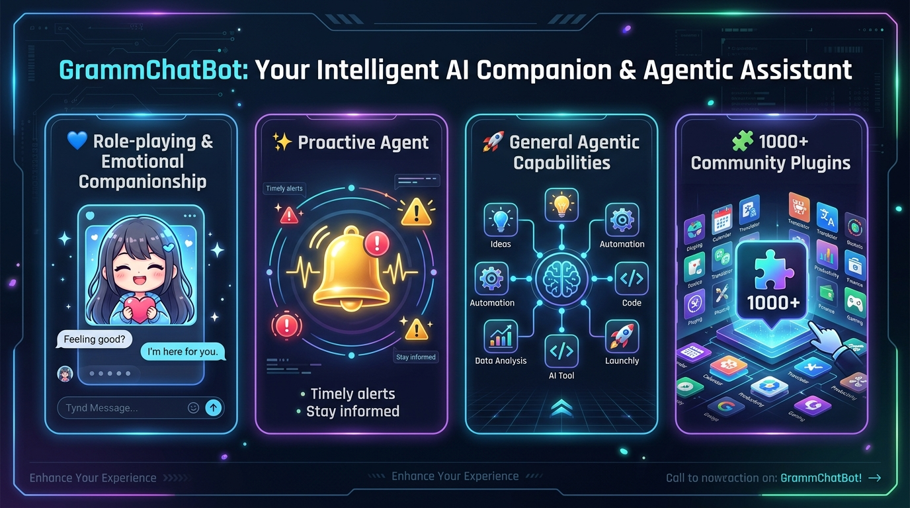

<div align="center">


# ⚡ GrammChatBot - FCA to TCA Framework Port with AstrBot AI Engine

```
   ██████╗ ██████╗  █████╗ ███╗   ███╗███╗   ███╗██████╗██╗██╗  ██╗██████╗  ██████╗ ████████╗
  ██╔════╝ ██╔══██╗██╔══██╗████╗ ████║████╗ ████║██╔════╝██║██║  ██║██╔══██╗██╔═══██╗╚══██╔══╝
  ██║  ███╗██████╔╝███████║██╔████╔██║██╔████╔██║██║     ██║███████║██████╔╝██║   ██║   ██║   
  ██║   ██║██╔══██╗██╔══██║██║╚██╔╝██║██║╚██╔╝██║██║     ██║██╔══██║██╔══██╗██║   ██║   ██║   
  ╚██████╔╝██║  ██║██║  ██║██║ ╚═╝ ██║██║ ╚═╝ ██║╚██████╗██║██║  ██║██████╔╝╚██████╔╝    ██║   
   ╚═════╝ ╚═╝  ╚═╝╚═╝  ╚═╝╚═╝     ╚═╝╚═╝     ╚═╝ ╚═════╝╚═╝╚═╝  ╚═╝╚═════╝  ╚═════╝    ╚═╝   
```

[](https://opensource.org/licenses/MIT)
[](https://core.telegram.org/bots/api)
[](https://nodejs.org/)
[](./test/testAll.js)
[](./system/ai-core.js)

**GrammChatBot** is an elite Node.js bot framework providing a **1-to-1 API Adapter Port** of [Goatbot-V2](https://github.com/lazyneoaz/Goatbot-V2.git) from Facebook Messenger (FCA) to Telegram (TCA), supercharged with **AstrBot-inspired Agentic AI Capabilities**.

By utilizing the built-in **FCA to TCA Adapter Layer** ([`system/api-adapter.js`](./system/api-adapter.js)) and **Agentic AI Core** ([`system/ai-core.js`](./system/ai-core.js)), existing Goatbot V2 Facebook commands using `api.sendMessage()`, `event.threadID`, and `event.senderID` run natively on Telegram alongside autonomous multi-LLM Agentic AI workflows!

</div>

---

## 🌟 Core Agentic Capabilities & Ecosystem

<div align="center">



</div>

### 💙 1. Role-playing & Emotional Companionship
- **Character Persona Presets**: Customizable system prompts & emotional companion personas.
- **Local & Cloud RP Engines**: Supports SillyTavern character cards, Ollama local roleplay, and OpenAI/Gemini personas.

### ✨ 2. Proactive Agent
- **Proactive Notifications**: Event-triggered scheduled reminders, background cron tasks, and group alerts.
- **Contextual Engagement**: Monitors thread activity to provide timely suggestions and automated assistance.

### 🚀 3. General Agentic Capabilities
- **Multi-Provider LLM Routing**: 11+ supported model services (**OpenAI**, **Gemini**, **Claude**, **DeepSeek**, **Groq**, **Ollama**, **Moonshot Kimi**, **GLM**, **Qwen**, **OneAPI**).
- **Autonomous Tool Execution**: LLM function calling for **Web Search**, **Code Interpreter Sandbox**, and **Task Scheduler**.
- **Multimodal (Vision & Audio)**: Image recognition & Speech-to-Text (Whisper).
- **RAG Knowledge Base**: Retrieval-Augmented Generation for indexing documents and PDF context.

### 🧩 4. 1000+ Community Plugins Collection
- **AstrBot Plugins Collection Marketplace**: Direct integration with [`AstrBotDevs/AstrBot_Plugins_Collection`](https://github.com/AstrBotDevs/AstrBot_Plugins_Collection.git).
- **Modular Star Plugins System**: Dynamic plugin loading, tool registration (`register_tool`), and Web UI marketplace management.

---

## 🎨 AI Image Tools Showcase

<div align="center">


</div>

- **`/image <prompt>` (`/dalle`)**: Generates high-definition AI digital art from text prompts.
- **`/edit <style>` (`/filter`)**: Applies AI transformations to replied photos.
- **`/upscale` (`/4k`, `/hd`)**: Enhances image quality to 4K resolution.
- **`/removebg` (`/nobg`)**: Removes backgrounds and exports transparent PNGs.

---

## 📊 Express Web Dashboard & AI Control Panel

<div align="center">


</div>

The integrated Express web server serves a live management dashboard on `process.env.PORT` (`http://localhost:5000`):

- **System Stats Panel**: Polling status, active token index, total tokens, uptime, and RAM usage.
- **AI Control Panel**: Interactive UI to switch LLM Provider, update System Prompt Persona, and toggle Tool Execution.
- **Plugins Marketplace**: Browse, install, and uninstall plugins from the AstrBot Plugins Collection.

---

## 📂 Project Structure

```
GrammChatBot/
├── images/
│   ├── banner.jpg              # Cute Anime Girl Mascot Header
│   ├── agentic_features.jpg    # Core 4 Pillars Agentic Features Showcase
│   ├── ai_demo.jpg             # AI Image Tools Showcase Banner
│   └── dashboard_preview.jpg   # Express Web Analytics Dashboard Mockup
├── index.js                    # Main process entry launcher & dashboard
├── Goat.js                     # Core bot framework orchestrator
├── bot.js                      # Telegram event listener & router
├── config.json                 # Bot tokens, developer ID & permission lists
├── package.json                # Project dependencies
├── system/
│   ├── api-adapter.js          # Core FCA-to-TCA API Wrapper Adapter
│   ├── ai-core.js              # AstrBot-inspired Agentic AI Engine (Multi-LLM, RAG, Tools)
│   ├── astrbot-api.js          # AstrBot API Specs (@filter, MessageChain, Star Tool Registry)
│   └── astrbot-plugins.js      # AstrBot Plugins Collection Marketplace & Manager
├── includes/
│   ├── handleReply.js          # System listener for onReply
│   ├── handleReaction.js       # System listener for onReaction
│   └── handleEvent.js          # System listener for onEvent
├── bot/
│   ├── telegram/
│   │   ├── tokenManager.js     # Multi-token manager & rate-limit failover
│   │   └── handlerTelegram.js  # grammY update interceptor & role matrix
│   └── cron/
│       └── autoCleanup.js      # 30-minute cache & memory cleanup cron job
├── dashboard/                  # Express.js Web Dashboard
│   ├── app.js                  # Express web server & AstrBot APIs
│   └── views/
│       └── stats.eta           # Real-time HTML stats & AI control panel template
├── utils/
│   └── levenshtein.js          # Levenshtein distance typo suggestion engine
├── test/
│   └── testAll.js              # Comprehensive automated test suite (100% Pass)
└── scripts/
    └── cmds/                   # Modular commands folder
        ├── ai-chat.js          # AstrBot AI Agent command (/ai /ask) in Goatbot syntax
        ├── example.js          # FCA-syntax command test (/examplecmd)
        ├── newcommand.eg.js    # Template command file
        ├── eval.js             # Level 4 Developer JS evaluator
        ├── shell.js            # Level 4 Developer shell executor
        ├── admin.js            # Level 3/4 Admin control panel
        ├── image.js            # AI image generator (Stream)
        ├── edit.js             # AI image editor (Stream)
        ├── upscale.js          # AI 4K image upscaler (Stream)
        ├── removebg.js         # AI background remover (Stream)
        ├── help.js             # Dynamic command menu
        ├── stats.js            # Bot memory & status
        └── ping.js             # Latency check
```

---

## 💻 Developer Guide: Writing Commands in Native FCA Syntax

Thanks to [`system/api-adapter.js`](./system/api-adapter.js), you can write commands using the exact original Goatbot-V2 Facebook syntax:

```javascript
const aiCore = require("../../system/ai-core.js");

module.exports = {
  config: {
    name: "ai",
    aliases: ["ask"],
    version: "2.1",
    author: "frnAlt & Gtajisan",
    countDown: 3,
    role: 0,
    description: { en: "Chat with Agentic AI Core" },
    category: "ai-agent"
  },

  // Classic Goatbot V2 signature
  onStart: async function ({ api, event, args, message, getLang }) {
    const prompt = args.join(" ");
    if (!prompt) return message.reply("Please ask a question!");

    const response = await aiCore.generateCompletion({
      prompt,
      contextId: `${event.threadID}_${event.senderID}`
    });

    api.sendMessage(
      `🤖 [${aiCore.getProvider().toUpperCase()}]\n\n${response}`,
      event.threadID,
      (err, info) => {
        api.setMessageReaction("🧠", event.messageID, event.threadID);
      },
      event.messageID
    );
  }
};
```

---

## 🧪 Testing & Verification

Run the comprehensive automated test suite:
```bash
node test/testAll.js
```
Expected Output:
```
==================================================
📊 TEST RESULTS: 14 Passed, 0 Failed
==================================================
```

---

## 🚀 Installation & Deployment Guide

### 1. Local Setup
```bash
git clone https://github.com/frnAlt/GrammChatBot.git
cd GrammChatBot
npm install
# Edit config.json with your Telegram tokens and user ID
npm start
```

### 2. Render (Free Tier 512MB RAM)
1. Create a **Web Service** on [Render](https://render.com).
2. Connect your GitHub repository.
3. Build Command: `npm install`
4. Start Command: `npm start`
5. Set Environment Variable: `PORT=5000`

### 3. Railway
1. Deploy project from GitHub on [Railway](https://railway.app).
2. Add `PORT=5000` environment variable.
3. Railway automatically detects `npm start`.

### 4. VPS Deployment (PM2)
```bash
npm install -g pm2
pm2 start index.js --name "grammchatbot" --node-args="--expose-gc --max-old-space-size=400"
pm2 save
pm2 startup
```

---

## 📜 License & Credits

- **Original Architecture**: [Goat-Bot-V2](https://github.com/ntkhang03/Goat-Bot-V2) by NTKhang & Modded by frnAlt & Gtajisan.
- **AI Engine**: AstrBot-inspired Agentic AI Engine & Plugins Collection.
- **Telegram Adapter Port**: GrammChatBot by frnAlt & Gtajisan.
- **License**: MIT
